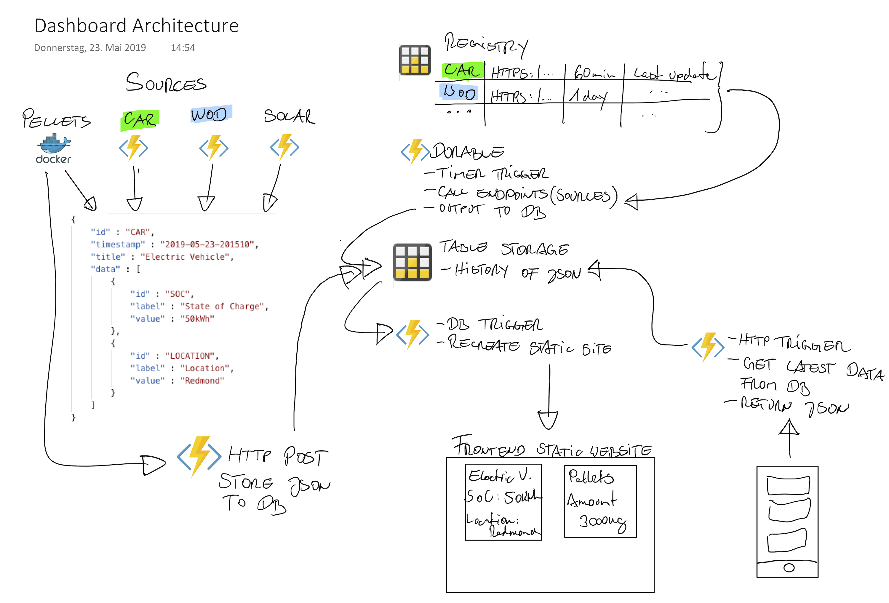

# Dashboard

This is the source repo for a project I'm streaming live on Twitch. You can find the stream at:

https://www.twitch.tv/reneruppert

**Please follow to not miss upcoming events!**

Recorded versions of each session are available on Youtube:

https://www.youtube.com/playlist?list=PLTDEGRa8OTnfBQprehS1IXtaed53i0iO5

**Subscribe to be notified about new uploads!**

If you'd like to contact me, feel free to use Twitter:

https://twitter.com/rene_ruppert

## Content

I'm building out a digital dashboard to show information about various data sources I typically check every day. This includes things like:

* What's the state of charge of my electric vehicle?
* How much power is the solor installation generating?
* What's the workout of the day at my gym?
* How many tons of wood pellets are left in my central heating's storage?

A rough architecture diagram is trying to visualize the setup:

## Details

A source can be one of two different types

* a URL returning JSON data in a specific format (see diagram)
* an application/service that actively provides [JSON data in above format](assets/source_template.json).

I'm planning to add four sources to begin with:

* Pellets: amount of wood pellets left in my basement. This is going to be executed on a local device (maybe a Rapberry) and actively uploads data to the cloud.
* Car: my car can be accessed via a restful API. This is going to be implemented as an Azure Function.
* WOD: Workout of the day. Another Azure Function which does screen scraping from my gym's website.
* Solar: my inverter (SolarEdge) seems to have a web based API I'm planning to access. Again, this will be an Azure Function.

Other source can be built on demand. All sources generate JSON data - that's the only requirement.
In order to visualize data of the sources, I want to add a frontend that ist probably going to be a single page website. Another client type could be a (Xamarin) mobile app or something as basic as a console app.

JSON returned by a source contains an array of data points in the format of "label" and "value". So *any* source can be displayed without changing the client.

## Requirements

* Implementation must be flexible and maintainable.
* New sources can be added easily without redeploying everything.
* Low cost: running it in the cloud should be cheap.

## Implementation

The following information is true for sources accessible via a URL endpoint. "Actice" sources (like the "Pellets" in my example) need to take a slightly different approach. See furthe below.

### Registry

There will be a registry where all sources are...well...registered. :-) The registry stores the source's ID, the URL of the endpoint, the schedule how often it should be run and the last execution date/time.

### Aggregator

A timer triggered durable Azure Function will scan the registry, get the returned data from all endpoints and store the results in a Cosmos Table Storage (history database).

### History database

The database stores all JSON returned by all of the sources.

### Website

The website is a static page that gets regenerated whenever a new entry into the history DB has been made. I don't know yet how exactly this is going to work. :-)

### (Mobile) clients

Non-website clients can actively request source data from the DB by calling another HTTP GET triggered Azure function.

## Non-URL based sources

The pellets source is not reachable from the internet - my central heating unit is only accessible from within my local network. The plan is to have a local device (Raspberry) with a Docker image running some code that peridocally gets data about wood pellets supplies and then converts this into the sources' JSON format. An HTTP POST triggered Azure function will accept this JSON and directly store it into the history DB. Then, the data flows just like it does for the URL based sources.

## Final words

I'm doing this project "as-we-go". I think all of this should work...but who knows. Could be that plans are changing. If you have proposals or see problems, your're invited to submit issues or pull requests!

